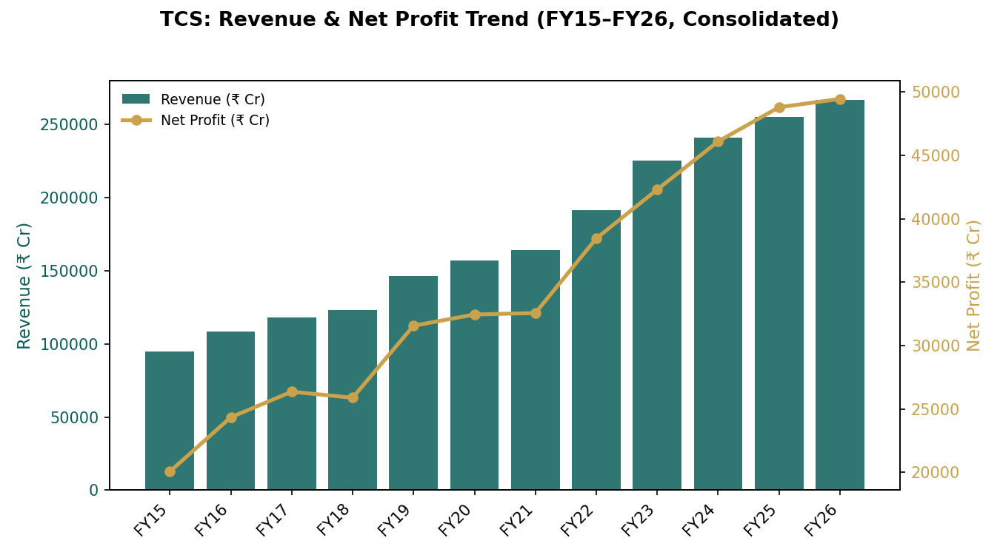
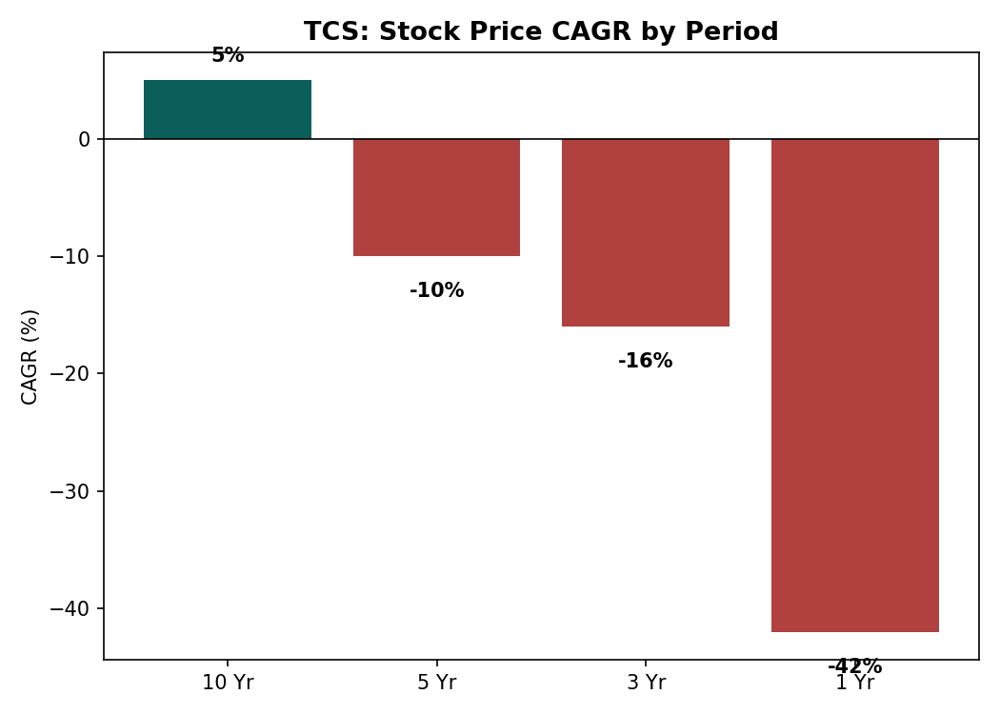
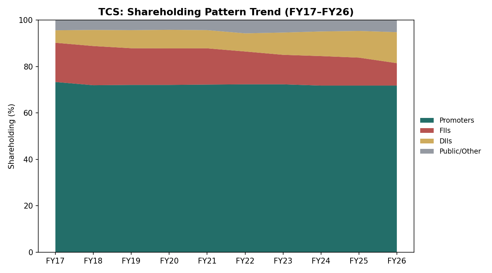
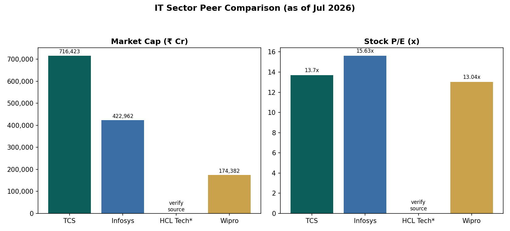

# Tata Consultancy Services (TCS) — Fundamental Research Report
**NSE: TCS | BSE: 532540 | Sector: IT Services & Consulting**
*Data as of ~July 1–6, 2026. Sources: Screener.in (primary), news wires. Cross-checked where possible.*

---

## 1. Snapshot

| Metric | Value |
|---|---|
| CMP | ₹1,983 |
| Market Cap | ₹7,16,423 Cr |
| Face Value | ₹1.00 |
| 52W High / Low | ₹3,490 / ₹1,976 |
| Stock P/E | 13.7x |
| Book Value | ₹296 |
| Dividend Yield | 3.23% |
| ROCE | 63.0% |
| ROE | 51.8% |

*Source: Screener.in, close price July 1, 2026.*

**Note on the 52-week range:** the stock is trading barely above its 52-week low (₹1,976) versus a high of ₹3,490 — implying roughly a 43% drawdown from the yearly peak. 🚩 This is a material fact worth verifying independently against a live quote before acting on it.

---

## 2. Valuation

- **Stock P/E: 13.7x** — well below TCS's own long-term average (TCS has historically traded in the low-to-mid 20s–30s P/E range) and below where large-cap IT peers like Infosys (P/E ~15.6x) currently sit.
- Using the report's interpretation framework (Cheap = below sector & history; Fair = within ~10%; Expensive = above both): at 13.7x, TCS screens as **cheap relative to its own history**, and roughly in line with or slightly below current sector peers.
- **Price-to-Book:** CMP ₹1,983 vs Book Value ₹296 → P/B ≈ 6.7x. This is high in absolute terms, which is typical for an asset-light, high-ROE IT services business rather than a capital-intensive one — P/B should not be read in isolation here.
- Dividend yield of 3.23% is elevated for TCS versus its own history, mechanically because the price has fallen sharply while the dividend payout has stayed high (77.5% recently) — a byproduct of price decline, not necessarily improved capital return generosity.

🚩 Sector P/E and 5-year average P/E for TCS specifically were not pulled with precision in this session — verify current sector P/E at Screener.in or Tickertape before treating "cheap" as a settled conclusion.

---

## 3. Growth

| Metric | 10Y | 5Y | 3Y | TTM |
|---|---|---|---|---|
| Sales CAGR | 9% | 10% | 6% | 5% |
| Profit CAGR | 8% | 9% | 8% | 8% |

- Revenue has grown from ₹94,648 Cr (FY15) to ₹2,67,021 Cr (FY26) — steady compounding, but the growth rate has **decelerated** in the most recent years (TTM sales growth of 5% vs a 10-year average of 9%).
- Screener's own auto-generated flag notes: <cite index="10-1">the company has delivered a poor sales growth of 10.2% over the past five years</cite> relative to what's typically expected of a premium-multiple compounder — worth noting as a genuine caution flag rather than dismissing it.
- Classification per the report's framework: **Slowing** growth trend (still positive, but decelerating from historical pace).

---

## 4. Financial Health

| Metric | Value | Interpretation |
|---|---|---|
| Debt / Equity | ~0.10 (₹11,283 Cr borrowings / ~₹1,07,240 Cr equity, FY26) | **Safe** (<1) |
| Interest Coverage | ~59x (Operating profit ₹72,398 Cr / Interest ₹1,227 Cr, FY26) | **Healthy** (>3) |
| Free Cash Flow | ₹48,013 Cr (FY26), up from ₹16,426 Cr (FY15) | **Strong** — positive and growing consistently every year |
| Current Ratio | 🚩 Data unavailable in this session — verify at Screener.in balance sheet tab | — |

TCS is essentially debt-free in any meaningful sense for a company of its size — the balance sheet is a genuine strength, not a marginal one.

---

## 5. Returns

| Metric | 10Y avg | 5Y avg | 3Y avg | Last Year |
|---|---|---|---|---|
| ROE | 43% | 49% | 52% | 52% |
| ROCE (last year) | — | — | — | 63% |

Both ROE and ROCE are **well above the "Good" threshold (>15%)** in this framework, and have actually been *improving* over the last decade rather than fading — a genuinely rare combination alongside decelerating growth.

**Stock price CAGR (a reminder that fundamentals and the share price haven't moved together lately):**

| Period | Price CAGR |
|---|---|
| 10 Yr | +5% |
| 5 Yr | −10% |
| 3 Yr | −16% |
| 1 Yr | −42% |

This is a striking divergence: fundamentals (ROE, ROCE, FCF) have stayed strong or improved, while the stock price has fallen sharply, especially over the last year. That gap is exactly why the P/E has compressed to 13.7x from historically richer multiples.

---

## 6. Ownership & Shareholding Trends

| Holder | Jun 2023 | Mar 2026 (latest) | Trend |
|---|---|---|---|
| Promoters | 72.30% | 71.77% | Broadly stable |
| FIIs | 12.46% | 9.66% | **Declining** |
| DIIs | 9.80% | 13.34% | **Rising** |
| Public/Other | 5.44% | 5.22% | Broadly stable |

- No pledging of promoter shares was flagged in the data reviewed — this is a positive governance signal (>10% pledging would be a red flag; none was indicated here). 🚩 Verify directly on the shareholding pattern page for the most current pledge disclosure.
- The steady **FII selling absorbed by DII buying** over the past ~3 years is a notable structural trend — domestic institutions (mutual funds, insurers) have been net accumulators even as foreign investors have trimmed exposure.
- Promoter holding (Tata Sons) has been essentially flat, signaling no change in control or confidence from the parent.

---

## 7. Sector Context & Latest Developments

Indian IT stocks — TCS included — have been under broad pressure. <cite index="11-1">The combined market cap of the top five IT majors has fallen over 46% from August 2024 peaks to July 2026 levels</cite>, driven by concerns about slowing global tech spending and AI-led pricing pressure on traditional services work. Brokerage commentary reviewed suggests the sector faces further guidance downgrades in the near term, though <cite index="11-2">TCS was named among a brokerage's preferred large-cap IT picks</cite> relative to some peers, for whatever that's worth as one data point among many analyst views (not a recommendation Claude is endorsing).

- TCS's Q1 FY27 results are due **9 July 2026**, with the board also considering an interim dividend (record date 15 July 2026).
- Recent order wins include a multi-year deal with Elopak to transform its IT operations.

---

## 8. Peer Comparison

| Company | Market Cap (₹Cr) | P/E | ROE |
|---|---|---|---|
| **TCS** | 7,16,423 | 13.7x | 51.8% |
| Infosys | 4,22,962 | 15.63x | 30.8% (3Y avg) |
| HCL Tech | 🚩 verify at source | 🚩 verify at source | 🚩 verify at source |
| Wipro | 1,74,382 | 13.0x | 🚩 verify at source |

TCS is the clear leader on market cap and ROE among peers reviewed, while trading at a **lower P/E than Infosys** despite superior returns on capital — a combination that, at face value, looks favorable on relative valuation grounds, though this alone isn't sufficient to make an investment call.

🚩 HCL Technologies figures and Wipro's precise ROE were not confirmed with sufficiently reliable sourcing in this session — verify directly at Screener.in/Tickertape before relying on them.

---

## 9. View: Strengths, Watch-Points, and Overall Read

**Strengths**
1. Exceptional and improving capital efficiency — ROE 52% (3Y avg), ROCE 63% (latest), both well above typical "good" thresholds.
2. Essentially debt-free balance sheet (D/E ~0.10) with very high interest coverage (~59x).
3. Consistently growing free cash flow (₹48,013 Cr in FY26, up steadily from ₹16,426 Cr in FY15) and a strong, sustained dividend payout track record (~77.5% recently).

**Watch-points**
1. Revenue growth has genuinely decelerated — TTM sales growth of just 5% against a 10-year average of 9%, alongside Screener's own auto-flag on "poor" 5-year sales growth.
2. FII holding has fallen from ~12.5% to ~9.7% over three years — a persistent trend worth monitoring, even though DIIs have offset it.
3. The stock's price has fallen sharply (−42% over 1 year, −16% over 3 years) even as fundamentals held up — this could reflect either an emerging value opportunity or the market pricing in a structural slowdown from AI-driven pricing pressure in IT services; the report deliberately does not resolve which of these is "right."

**Key metric to track going forward:** Q1 FY27 revenue growth guidance and margin commentary at the July 9, 2026 earnings call — this will be the next clear signal on whether the "slowing growth" trend is stabilizing or deepening.

**Overall Fundamental Quality: Strong**, with a genuine and unresolved tension between best-in-class capital efficiency/balance sheet strength and a decelerating growth profile amid sector-wide AI disruption concerns.

**Data confidence: Moderate–High** — core financials (P&L, balance sheet, cash flow, shareholding) are sourced directly from Screener.in's aggregated filings data and appear internally consistent; a few specific peer data points (HCL Tech, some Wipro ratios) could not be confirmed to the same standard and are flagged above.

---

*This is a view of the fundamentals for educational purposes only. It is not investment advice and not a buy/sell/hold recommendation. Verify all figures independently. The final decision is yours.*
